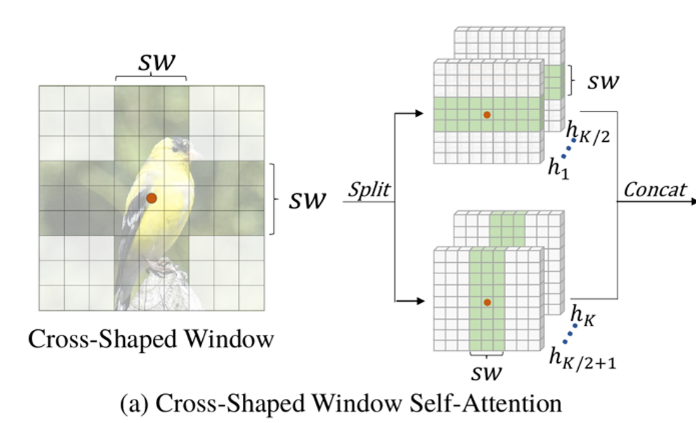
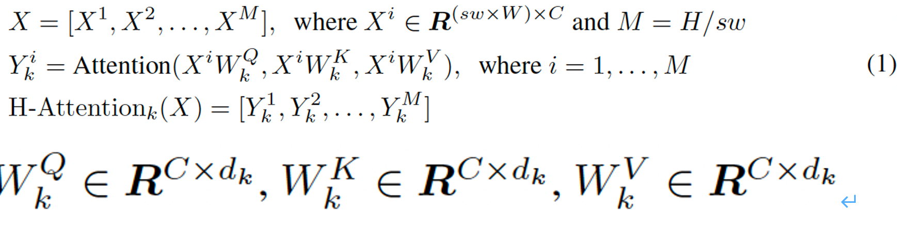
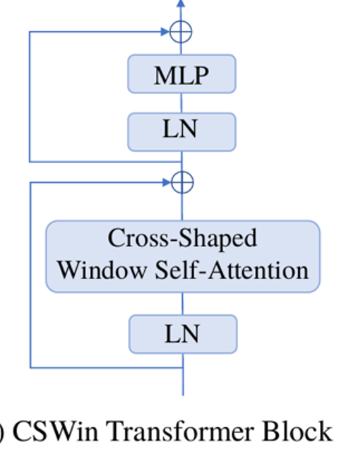
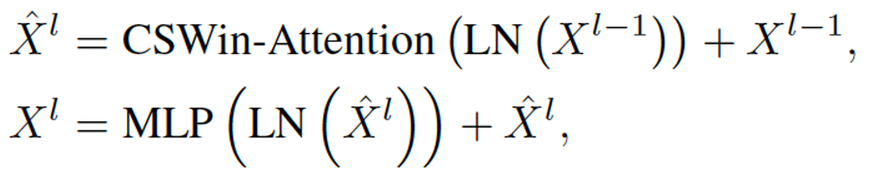
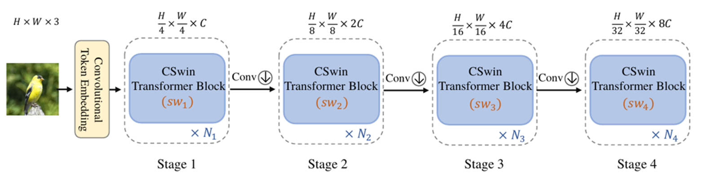
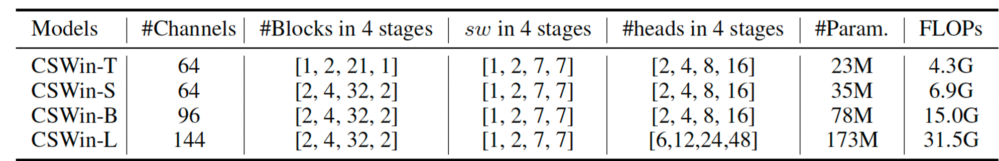

# CSWin

## compare with self-attention
1.使用Cross-Shaped Window自注意力取代自注意力机制
2.LePE 位置编码
## Cross-Shaped Window self-attention
通过在形成十字形窗口的水平和垂直条纹中平行执行自注意力来实现。

水平方向

垂直方向
$X∈R^{(H×sw)×C}$ ，$d_k=C/K$,$K$是多头的头
## 位置编码

## CSwin block

## 结构

