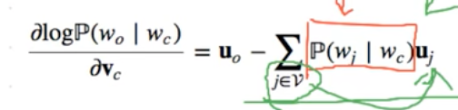

为什么不使用one-hot：词向量无法表达不同词之间的相似度。
# word2vec
Word2Vec是从大量文本语料中以无监督的方式学习语义知识的一种模型。可以较好的表达不同词之间的相似和类比关系
## Skip-gram
### concept
使用一个词来预测它在文本序列周围的词。使用极大似然估计。目标词与背景词

## CBOW(continuous bag of words)
根据背景词来生成中心词

2m个词向量求平均

## negative sampling
提高训练速度。负采样让训练样本每次只更新一小部分的权重，降低梯度下降过程中的计算量。

sigmoid代替softmax,计算开销：$O(|V|)$->$O(K)$

skip-gram negative sample loss function 

CBOW negative sample loss function 

## hierarchical softmax(层序softmax)
利用二叉树。树中的每个叶子节点代表着词典$V$中的每个词，每个词$w_i$相应的词向量位$v_i$。

计算开销：$O(|V|)$->$O(log|V|)$

## Glove
使用词与词之间的共现（co-occurrence）信息。$X$为共现词频矩阵，$x_{ij}$词j出现在词i环境中的次数
$v_i, v_j, \hat{v_k}$ 中心词，中心词，背景词

$f(x)=(x/c)^a$ (a=0.75)。从$X$中随机采样小批量非零元素，使用随机梯度下降算法迭代词向量和偏移项。当所有词向量学习得到后，GloVe使用一个词的中心向量与背景向量之和作为该词的最终词向量。
## fastText

## 应用
相似词与类比词
 